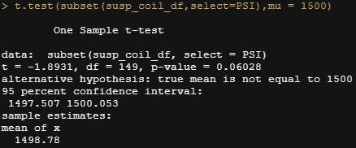
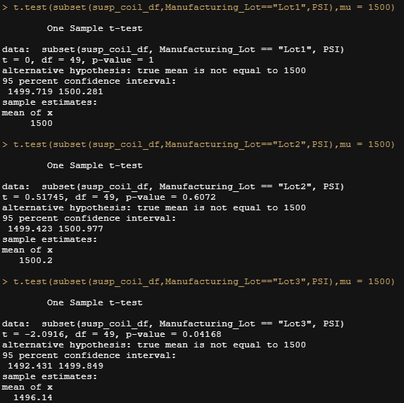

# MechaCar_Statistical_Analysis

## Linear Regression to Predict MPG

- Which variables/coefficients provided a non-random amount of variance to the mpg values in the dataset?
  - The vehicle length and ground_clearance provided the highest amounts of non-random variance to the mpg values
- Is the slope of the linear model considered to be zero? Why or why not?
  - Our slope isn't considered to be 0 because that would only be the case if there was no significant linear relationship, but with our p-value being way below our assumed significance level of 0.05% we can state there is sufficient evidence to reject the null hypothesis which would be a line with a slope of 0.
- Does this linear model predict mpg of MechaCar prototypes effectively? Why or why not?
  - Yes because using a normal significance level of 0.05 our p value came in at 5.35e-11

## Summary Statistics on Suspension Coils

The current manufacturing data for all lots meets the dictate that the variance of the suspension coils must not exceed 100 PSI. However, when looking into that information at each lot, only lots 1 and 2 fall below that variance with lot 3 coming in way above at just over 170.

## T-Tests on Suspension Coils

In this case we tested to see if we could reject the null hypothesis of the sample sizes of the different PSI numbers gave us a statistically significant difference from the mean PSI of the population. Looking at the full list we can see the p-value comes in at over the normal significance level of 0.05 which means there isn't enough evidence to reject the null hypothesis:

Looking only at lots 1 and 2 we can see similar results. However, if we look at the results for Lot 3 we can see the p-value coming in just below the 0.05 which allows us to reject the null hypothesis so Lot 3 has a statistically significant difference in it's mean PSI than that of the population:

## Study Design: MechaCar vs Competition

We could create a study that test the maintenance cost of MechaCars vs the competition. We would need to collect data that shows the costs spent on the cars. We'd want to collect the mean maintenance costs by year and also include the model of the car. We could then compare the maintenance costs by year. Our null hypothesis would be that the yearly mean average of our cars maintenance costs would be similar to the competitions and our alternative hypothesis would be that our yearly mean costs would be lower. We could then do a two sample t test of the distribution of the yearly means between the competition and our data to find if there was a significant difference.
